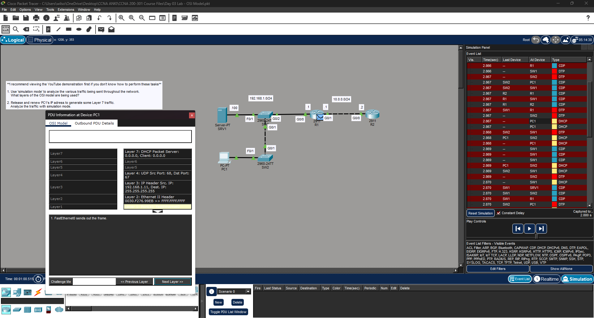

# Lab 3 — [OSI Model]

**Source:** Jeremy’s IT Lab — <Day 3 / [Free CCNA | OSI Model | Day 3 Lab | CCNA 200-301 Complete Course](https://www.youtube.com/watch?v=7nmYoL0t2tU)>  
**Date:** <2026-02-14>  
**Time:**   5 minutes  
**Artifact:** N/A

## What I did
- I used the command prompt on PC1 to release its IP address using ipconfig /release, and requested a new one using ipconfig /renew. 
- I watched the DHCP activity in the event list and observed it navigating from node to node. 

## Proof (minimum)
- Screenshot: 

## Notes
- This was fun but again I think it was more of a tool familiary exercise than something that helped me conceptually with TCP/IP. Anki flashcards are doing a lot more heavy lifting than labs right now. Very excited to get deeper into this.
