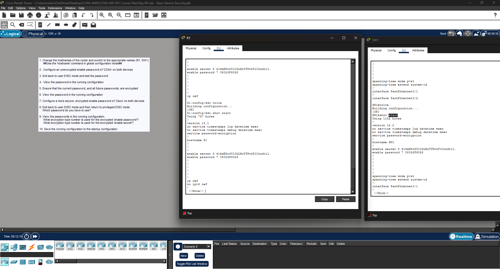

# Lab 4 — [Basic Device Security]

**Source:** Jeremy’s IT Lab — <Day 4 / [Free CCNA | Basic Device Security | Day 4 Lab | CCNA 200-301 Complete Course](https://www.youtube.com/watch?v=SDocmq1c05s)>  
**Date:** <2026-02-15>   
**Time:**   8 minutes 
**Artifact:** N/A 

## What I did
- I used the Cisco CLI to:
    - Change the hostnames of two devices using "Router/Switch(config)# hostname R1/SW1." 
    - Enable a simple password "CCNA" on both using "R1/SW1(config)# enable password CCNA"
    - Encrypt the password and future passwords on both devices using Cisco's Type 7 encryption using "R1/SW1(config)# service password-encryption
    - Configure enable secret on both devices (stored as an MD5 one-way (non-reversable) hash) using "R1/SW1(config)# enable secret Cisco"
    - Verify configurations on both devices using "R1/SW1(config)# do show run"
    - Verify that secret credential is requested when running "enable" from user EXEC mode. 
    - Saved configurations to startup-config using "R1/SW1(config)# do write"

## Proof (minimum) 
- Screenshot:  

## Notes
- This is the first lab that I felt was worth doing. I had studied CLI basics and could recall commands enough to get through my Anki flashcards, but actually using them really helped commit them to memory. This wasn't super difficult since I'm used to navigating the Terminal in Linux, but it helped.