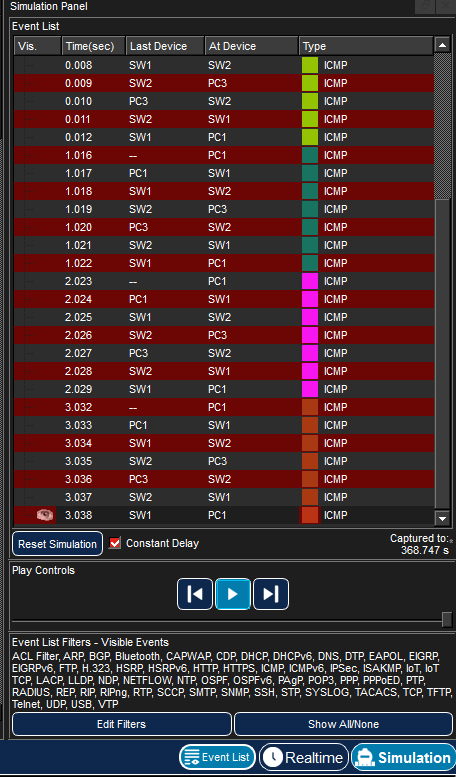
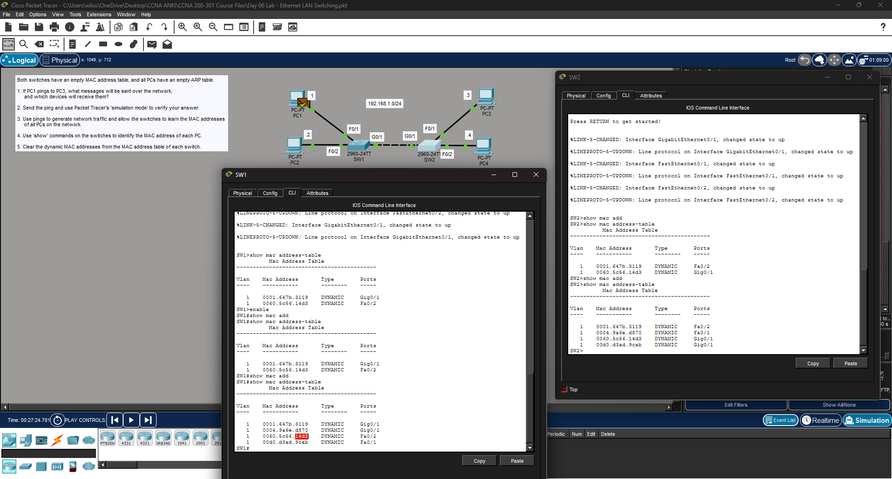

# Lab 05 — [Analyzing Ethernet Switching]

**Source:** Jeremy’s IT Lab — <Days 5 & 6 / [Free CCNA | Analyzing Ethernet Switching | Day 6 Lab | CCNA 200-301 Complete Course ](https://www.youtube.com/watch?v=Ig0dSaOQDI8)>  
**Date:** <2026-02-16>  
**Time:**   
**Artifact:** 

## What I did
- Answered question posed in lab (see notes).
- Actually sent the ping. Observed packet in event viewer to watch resolution of MAC address.
- Also observed the anatomy of the packet based on my learning so far.
- Used 'show mac address-table' on the switches to determine the MAC addresses of each PC
- Cleared the dynamic MAC addresses from the tables of each switch.

| Name | IP Address | MAC Address | 
|---|---|---|
| PC1 | 192.168.1.1 | 00d0.d3ad.9cab
| PC2 | 192.168.1.2 | 0060.5c56.14d3
| PC3 | 192.168.1.3 | 0004.9a6e.d870
| PC4 | 192.168.1.4 | 0001.647b.3119

## Proof (minimum)
- Event list screenshot: 

- Address tables screenshot: 

## Notes
- Question 1: If PC1 pings to PC3, what messages will be sent over the network, and what devices will receive them?
- - Answer: PC1 will broadcast an ARP request addressed to 192.168.1.3. PCs 2, 3, and 4 will receive this request, but PCs 2 and 4 will drop it because their IP address does not match the request. PC2 will give a unicast reply to PC1. PC1 then adds PC3's MAC address to its table, then sends an ICMP echo request to PC3, which then sends an ICMP echo reply to PC1, completing the ping.
