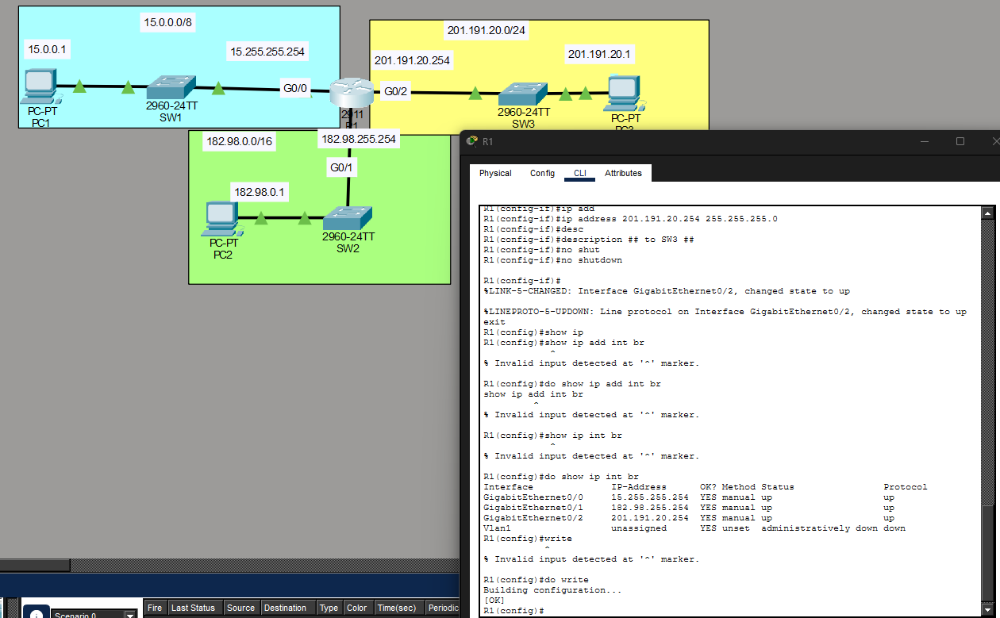
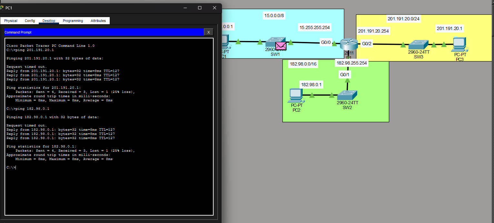

# Lab 06 — [Configuring IP Addresses]

**Source:** Jeremy’s IT Lab — <Days 7 & 8 / [Free CCNA | Configuring IP Addresses | Day 8 Lab | CCNA 200-301 Complete Course](https://www.youtube.com/watch?v=e1jbvyMeS5I)>  
**Date:** <2026-02-18>  
**Time:**   15 minutes
**Artifact:** 

## What I did
- Changed router hostname from 'Router' to 'R1'
- Used 'show ip interface brief' to view R1's interfaces and their statuses
- Configured R1 interface IPs to the listed values using CLI, saved to startup-config
- Configured PC IP addresses using the Packet Tracer GUI
- Pinged PC3 and PC2 from PC1 to test router configuration. Success.

## Proof (minimum)
- Routers configured:  

- Pinging outside the LAN: 

## Notes
- Packet Tracer took a while to simulate the ping traffic so I thought I was having an issue. Double checked the router interfaces and PC IP addresses and while doing that the pings succeeded. I'll just click through the steps next time.
