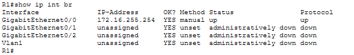
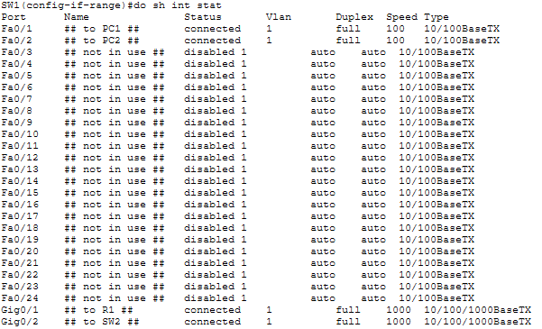
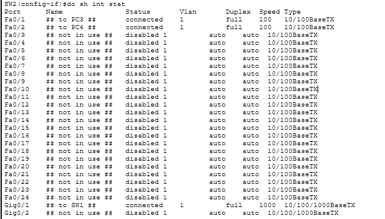
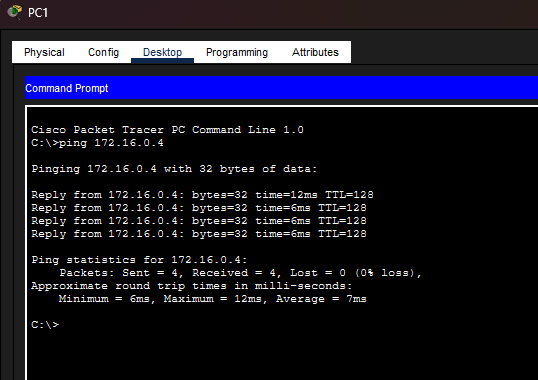

# Lab 07 — [Configuring Interfaces]

**Source:** Jeremy’s IT Lab — <Day 9 / [Free CCNA | Configuring Interfaces | Day 8 Lab | CCNA 200-301 Complete Course](https://www.youtube.com/watch?v=rzDb5DoBKRk)>   
**Date:** <2026-02-21>     
**Time:** 10 minutes  
**Artifact:**   

## What I did
- Configured hostnames on the router and switches
- Configured IP addresses on R1 interface and endpoints
- Manually configured speed and duplex settings on interfaces connected to other network devices
- Configured descriptions on each interface
- Disabled unused interfaces
- Saved configurations to startup-config
- Configured IP addresses for endpoints using Packet Tracer GUI
- Pinged PC4 from PC1 to test connectivity. Success.

## Proof (minimum)

R1 config: 

SW1 config: 

SW2 config: 

Pingtest: 

## Notes
- Easy. Much needed CLI practice. Really helped.
