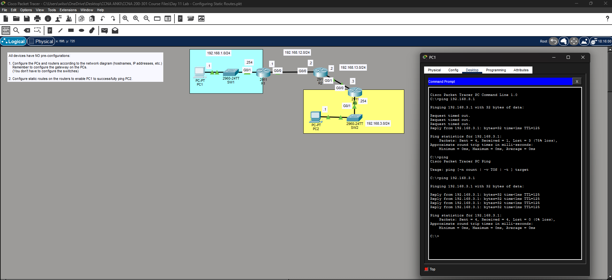
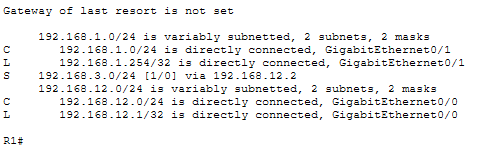
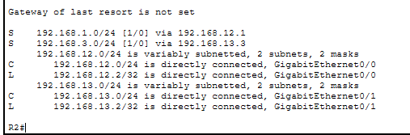
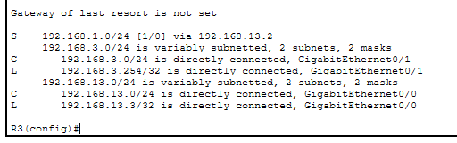

# Lab 8 — [Configuring Static Routes]

**Source:** Jeremy’s IT Lab — <Day 11 / [Free CCNA | Configuring Static Routes | Day 11 Lab 1 | CCNA 200-301 Complete Course](https://www.youtube.com/watch?v=XHxOtIav2k8)>  
**Date:** <2026-02-24>    
**Time:** 15 minutes  

## What I did
- Configured end host IP addresses and default gateways using configuration window.
- Configured interface IP addresses and descriptions on routers 1-3
- Turned on interfaces on routers 1-3
- Configured static routes on routers 1-3
- Pinged PC2 from PC1 to test connectivity. 
- - First ping had 75% packet loss due to ARP process down the line. Second ping had 0% loss.

## Proof (minimum)  
Ping results:  

R1 routing table:  

R2 routing table:  

R3 routing table:  

## Notes
- No configurations were given from scratch. 
- Nothing else to say, this was fun.

