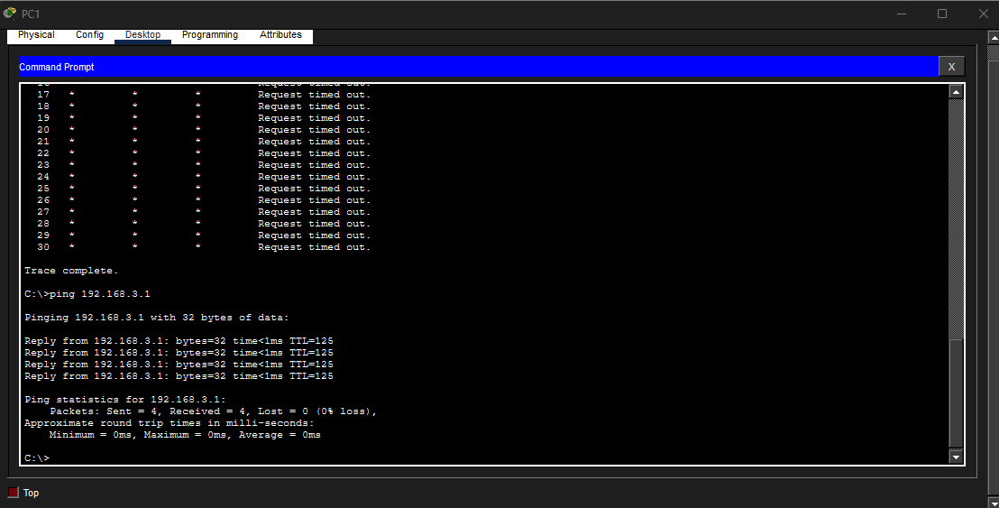

# Lab 9 — [Troubleshooting Static Routes]

**Source:** Jeremy’s IT Lab — <Day 11 / [Free CCNA | Troubleshooting Static Routes | Day 11 Lab 2 | CCNA 200-301 Complete Course ](https://www.youtube.com/watch?v=3z8YGEVFTiA)>  
**Date:** <2026-02-24>  
**Time:**   
**Artifact:** 

## What I did

- Checked ip route on each router.
- - R1
- - - Next hop IP is incorrect. Currently 192.168.12.3; should be 192.168.12.2
- - - - Removed incorrect address and added correct address
- - R2
- - - Static route into 192.168.3.0 is going out of g0/0, should be g0/1
- - - - Removed incorrect interface and added correct interface
- - R3 
- - - No static route configured at all
- - - - Configured route to 192.168.1.0 via 192.168.13.0
- Ping PC1 > PC2 unsuccessful. (100% packet loss)
- Ping PC2 > PC1 unsuccessful ("Destination host unreachable")
- Ran tracert from PC1 to PC2. Packets making it to R2 then dropping.
- R2 pings PC1 and not PC2. 
- Checked R3. IP address assigned to g0/0 is incorrect. Currently 192.168.23.3, should be 192.168.13.3. Removed incorrect entry and fixed.
- Ping PC2 from PC1. Success.

## Proof (minimum)

PC1 pings PC2:   

PC2 pings PC1:   

## Notes
- Finally a puzzle. Pretty simple, but a good reminder to pay attention to detail. I focused too much on R3 not having a static route that I didn't notice its g0/0 address was incorrect. Had a lot of fun. 
